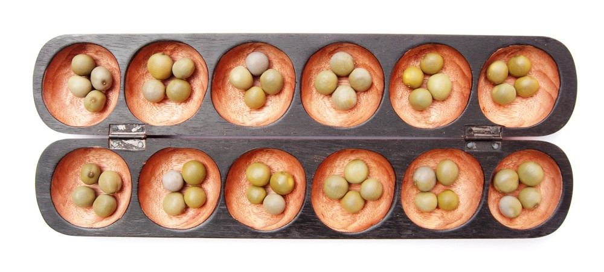

# Oware Game


## Introduction

The goal of this project is to develop a program to play the Oware game. Oware is a two-player board game played in different parts of the world under different names (Awari, Ouril, etc.) and with slightly different rules. In this project, we consider a simplified version of the Oware game.




## Game Board and Basic Rules

The game board consists of two rows of six pits. Each row belongs to a player. The game starts with 4 seeds in each of the 12 pits (48 seeds in total).
```
Player A:  |4|4|4|4|4|4|
Player B:  |4|4|4|4|4|4|
```

The two players play in turns. At each turn, a player chooses one of his pits (which must contain at least one seed) and distributes the seeds counter-clockwise around the board.

### Example

Player A starts the game and plays the second pit from the left:
```
Player A:  |5|0|4|4|4|4|
Player B:  |5|5|5|4|4|4|
```

Player B plays the sixth pit from the left:
```
Player A:  |5|0|5|5|5|5|
Player B:  |5|5|5|4|4|0|
```

Player A plays the third pit from the left:
```
Player A:  |6|1|0|5|5|5|
Player B:  |6|6|6|4|4|0|
```

Player B plays the third pit from the left:
```
Player A:  |6|1|0|6|6|6|
Player B:  |6|6|0|5|5|1|
```


## Object and End of the Game

The goal of the game is to take seeds on the opponent's pit row. Seeds can be taken when a single seed is in a pit by placing a second seed in the pit. If this happens, both seeds are removed from the pit.

### Example (cont.)

Player A plays the first pit from the left and takes B's seed in the sixth pit from the left. The score now is 2:0 in favour of A and 46 seeds remain in the game:
```
Player A:  |0|1|0|6|6|6|
Player B:  |7|7|0|6|6|0|
```

Player B plays the fifth pit from the left and takes A's seed in the second pit from the left. The score now is 2:2 and 44 seeds remain in the game:
```
Player A:  |0|0|1|7|7|7|
Player B:  |7|7|1|6|0|1|
```

The game ends if only 2 seeds remain in the game. Therefore, the possible final scores are 0:46, 2:44 to 46:0. Note that there is always a winner.


## Remarks

- As long as at least 4 seeds remain in the game, there exists a strategy to avoid an endless loop.
- Sometimes, more than one seed can be taken simultaneously in different pits of the opponent.
- If all pits of a player are empty, the other player can play multiple times, until the first player gets a seed.
- If a large number of seeds are in the same pit, distributing the seeds may go over more than one row.


## Tasks

1. Create a class diagram that models the data and logic of the game.
2. Implement the game such that two human players can play against each other.
3. Provide a user interface that visualizes the board, displays the score and allows the players to choose the pits to play.
4. Implement a player simulation such that a human player can play against the computer.
5. Optionally provide different game strategies for the simulation.
